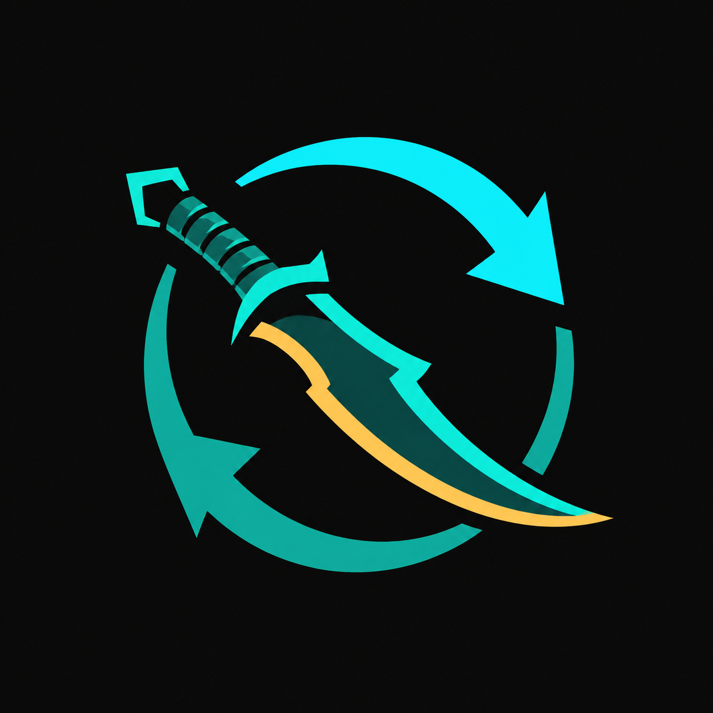
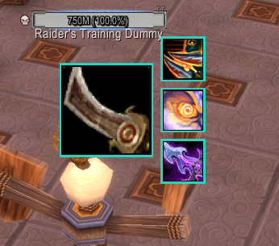
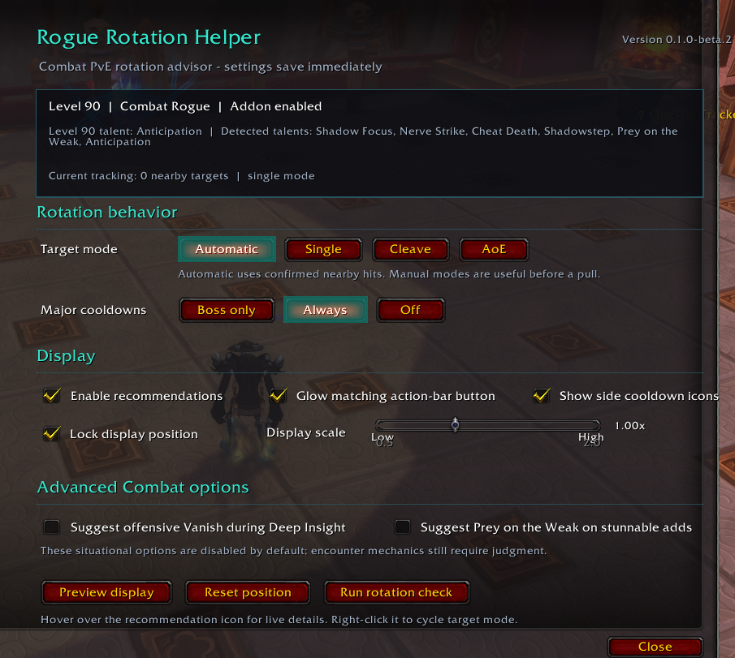

# Rogue Rotation Helper

  

Rogue Rotation Helper is a transparent, recommendation-only PvE addon for
Rogues in **World of Warcraft: Mists of Pandaria Classic**. It targets the
official **5.5.4 client (Interface 50504)** and currently supports **Combat**
in public beta plus **Assassination** and **Subtlety** as external alphas.

The addon shows what to press next. It never casts a spell, presses a key,
targets a unit, sends chat, or automates gameplay.

## Download the public beta

Download `RogueRotationHelper-0.1.0-beta.2.zip` from the official
[GitHub Releases page](https://github.com/Lillefot92/RogueRotationHelper/releases).
The release ZIP contains only readable Lua source and documentation. Do not
install similarly named executables or third-party installers.

Combat has passed level-90 single-target dummy and live dungeon testing. The
remaining beta item is boss-specific cooldown validation on a live raid boss;
it is not required for general dungeon and dummy feedback.

Version `0.2.0-alpha.2` adds the first Assassination module without changing
the validated Combat priorities. It has passed its first level-90 live dummy
pass and is intended for a small external test. While Energy is being pooled,
the main icon shows the required Energy number and removes it as soon as the
recommendation is ready.

The local `0.3.0-alpha.2` test build adds the first Subtlety module. It is not
published yet; it must first pass the focused live checks in `TESTING.md`.

Found a problem? Use the public
[issue tracker](https://github.com/Lillefot92/RogueRotationHelper/issues) so the
report and its eventual fix remain visible to everyone.

## Screenshots

### Compact combat display

### In-game settings

## What the Combat beta includes

- A clean, large next-action icon; mouse over it for the recommendation reason
  and detailed state.
- Energy pooling with a compact target number, plus out-of-range warnings.
- Energy, Combo Points, Slice and Dice, Revealing Strike, Rupture, target mode,
  target count, and poison status in the mouseover tooltip.
- Larger, vertically stacked Killing Spree, Adrenaline Rush, and Shadow Blades
  cooldown icons that hide abilities until they are learned.
- A native in-game settings panel under **Options > AddOns**, also opened by
  entering `/rrh`.
- Single-target, cleave, and 8+ target AoE priorities.
- Automatic target mode using melee-range nameplates and recent confirmed
  melee/AoE hits, including neutral training dummies.
- Manual target-mode overrides for encounters where automatic counting cannot
  see enemies early enough.
- Blade Flurry on **and** off recommendations.
- Optional action-bar glow for the recommended spell.
- Boss-only, always-on, and disabled offensive-cooldown policies.
- Optional, disabled-by-default offensive Vanish advice during Deep Insight.
- A deterministic in-game rotation self-check.
- Level-aware talent detection, including safe use below level 90.
- A high-priority warning when Deadly Poison or the selected non-lethal poison
  is missing or close to expiring.
- DPS-relevant talent support: all three level-90 choices, stealth-row damage
  choices, Deadly Throw while disconnected, talented poisons, and optional
  Prey on the Weak advice for stunnable enemies.

## What the Assassination alpha includes

- Automatic specialization detection and a separate Assassination evaluator;
  switching specs does not require reloading or changing a setting.
- Mutilate from Stealth, Blindside and execute-phase Dispatch, Slice and Dice,
  Rupture, pooled Envenom, and Marked for Death priorities.
- Vendetta and Shadow Blades pairing, plus disabled-by-default offensive Vanish
  and Preparation advice.
- Two-to-three target Rupture spreading, four-to-eight target Fan of Knives
  and 3+ point Rupture behavior, and a nine-or-more target Envenom/Fan of
  Knives priority.
- Assassination-specific hover details and Vendetta, Shadow Blades, and Vanish
  side cooldown icons.
- Shared poison, range, target-counting, talent, action-bar glow, and settings
  support from the Combat beta.

## What the Subtlety alpha includes

- Premeditation into Slice and Dice setup, Ambush stealth windows, Backstab,
  Hemorrhage, five-point Rupture, and Eviscerate priorities.
- Find Weakness and Shadow Dance tracking, with an `80` Energy pooling marker
  before safe Shadow Dance and offensive Vanish windows.
- Shadow Blades pairing and Preparation advice as part of the normal Subtlety
  cooldown model; the optional Combat/Assassination Vanish checkbox does not
  control Subtlety.
- Automatic AoE at three targets: Fan of Knives outside Dance, Ambush during
  Dance at three to four targets, and Fan at all times on five or more targets.
- Five-point Crimson Tempest maintenance in AoE, Subtlety-specific hover
  timers, and Shadow Dance, Shadow Blades, and Vanish side cooldown icons.
- A Backstab usability check that falls back to Hemorrhage when Backstab is not
  available from the player's current position.

## Level-aware and level-90 talent support

The helper does not assume that the Rogue is level 90. Unlearned abilities are
removed from the priority automatically. At level 86 it runs the complete
available supported rotation without asking for a level-90 talent.

- Combat uses Ambush from Stealth, Assassination uses Mutilate, and Subtlety
  uses Premeditation/Ambush. Nightstalker, Shadow Focus, live in-game Energy
  costs, and Subterfuge's extended Stealth window are recognized.
- Deadly Throw can preserve damage when a talented Rogue is forced out of
  melee range.
- Leeching Poison and Paralytic Poison are recognized as selected non-lethal
  poison talents and are included in preparation warnings.
- Prey on the Weak advice is available with `/rrh prey on`. It is off by
  default because bosses are immune and the addon cannot guarantee that a
  particular raid add is stunnable.
- Shuriken Toss is used as a ranged builder, Marked for Death is used at zero
  Combo Points, and Anticipation charges are tracked when those level-90
  talents are learned.
- At level 90, the panel reports the selected final-row talent. Shadow Blades
  is learned and automatically joins the side cooldown column.

## Current Phase 5 Combat rotation model

The priority is specifically built for the current 5.5.4 rules, rather than an
older launch-version MoP rotation.

1. Before combat, apply Deadly Poison and a non-lethal poison. A selected
   Leeching or Paralytic Poison talent becomes the preferred non-lethal poison.
2. Toggle Blade Flurry appropriately for the selected target mode.
3. Open with Ambush from Stealth.
4. Use Marked for Death at zero Combo Points when talented.
5. Keep Slice and Dice active.
6. Keep Revealing Strike's target debuff active.
7. Use Killing Spree at safe Energy without overlapping Adrenaline Rush or
   Shadow Blades. Positioning still requires player judgment.
8. Pair Adrenaline Rush and Shadow Blades where possible.
9. On one target, maintain a 5-point Rupture when the target should live long
   enough, then spend excess points on Eviscerate.
10. In cleave, keep Blade Flurry active and use Eviscerate instead of Rupture.
11. At 8+ targets, use Fan of Knives and a 5-point Crimson Tempest when enemies
    should live for its duration.
12. Revealing Strike is the normal Phase 5 builder. Sinister Strike becomes the
    preferred builder while both Adrenaline Rush and a Heroism/Bloodlust-family
    effect are active.

The model is cross-checked against the current Wowhead Phase 5 guide and the
open-source WoWSims MoP Combat Rogue implementation/APL:

- https://www.wowhead.com/mop-classic/guide/classes/rogue/combat/dps-rotation-cooldowns-abilities-pve
- https://github.com/wowsims/mop/tree/master/sim/rogue/combat
- https://github.com/wowsims/mop/blob/master/ui/rogue/combat/apls/combat.apl.json

## Assassination alpha rotation model

1. Apply Deadly Poison and the selected non-lethal poison before combat.
2. Open with Mutilate from Stealth.
3. Establish Slice and Dice manually, then refresh it through Envenom and Cut
   to the Chase.
4. Keep Rupture active, prioritizing uptime over waiting for a perfect
   five-point refresh.
5. Pair Vendetta and Shadow Blades after Slice and Dice and Rupture are active.
6. Use Blindside Dispatch procs and replace Mutilate with Dispatch below 35%.
7. Pool Energy before five-point Envenoms when maintenance timers are safe.
8. At two to three targets, spread Rupture and otherwise use the normal
   single-target priority.
9. At four to eight targets, build with Fan of Knives and apply 3+ point
   Ruptures to current targets.
10. At nine or more targets, build with Fan of Knives and spend on Envenom so
    Deadly Poison supplies most of the AoE damage.

The alpha is cross-checked against the current Phase 5 guide and the open-source
WoWSims MoP Assassination APL:

- https://www.wowhead.com/mop-classic/guide/classes/rogue/assassination/dps-rotation-cooldowns-abilities-pve
- https://github.com/wowsims/mop/blob/master/ui/rogue/assassination/apls/assassination.apl.json

## Subtlety alpha rotation model

1. Apply poisons, use Premeditation from Stealth, and establish Slice and Dice.
2. Open with Ambush to create a Find Weakness window.
3. Maintain a five-point Rupture and the Hemorrhage bleed, then spend excess
   points on five-point Eviscerate.
4. Build with Backstab from behind and fall back to Hemorrhage when Backstab is
   unavailable from the current position.
5. Pool to 80 Energy before Shadow Dance when Slice and Dice and the relevant
   bleed timers safely cover the burst window.
6. Pair Shadow Blades with Shadow Dance, spend at five points, and otherwise
   use Ambush throughout Dance.
7. Use Vanish to refresh an expiring Find Weakness window while Dance is not
   about to return; Preparation can reset Vanish for another window.
8. At three to four targets, build with Fan of Knives outside Dance but retain
   Ambush during Dance. At five or more targets, use Fan even during Dance.
9. Maintain a five-point Crimson Tempest in AoE before spending on Eviscerate.

The alpha is cross-checked against the current Phase 5 guide, WoWSims source,
and its Subtlety APL:

- https://www.wowhead.com/mop-classic/guide/classes/rogue/subtlety/dps-rotation-cooldowns-abilities-pve
- https://github.com/wowsims/mop/tree/master/sim/rogue/subtlety
- https://github.com/wowsims/mop/blob/master/ui/rogue/subtlety/apls/subtlety.apl.json

## Installation

1. Exit World of Warcraft.
2. Download the versioned ZIP from the official GitHub Releases page. Avoid
   GitHub's automatically generated `Source code` archives because their
   versioned folder name is not the intended addon folder name.
3. Extract the archive into:
   `World of Warcraft/_classic_/Interface/AddOns`
4. Confirm the final path is:
   `Interface/AddOns/RogueRotationHelper/RogueRotationHelper.toc`
5. Start MoP Classic and enable **Rogue Rotation Helper** on the AddOns screen.
6. On a Combat, Assassination, or Subtlety Rogue, enter `/rrh test` to preview
   the display.
7. Enter `/rrh sim`; all rotation checks should pass.

## Commands

- `/rrh` or `/rrh options` - open the in-game settings panel.
- `/rrh help` - list controls.
- `/rrh mode auto|single|cleave|aoe` - choose target behavior.
- `/rrh cooldowns boss|on|off` - choose offensive-cooldown behavior.
- `/rrh glow on|off` - toggle action-bar glow.
- `/rrh vanish on|off` - toggle optional offensive Vanish advice.
- `/rrh prey on|off` - toggle conditional Prey on the Weak/Kidney Shot advice.
- `/rrh unlock` and `/rrh lock` - move or lock the display.
- `/rrh scale 1.2` - scale the display from 0.5 to 2.0.
- `/rrh test` - toggle a display preview.
- `/rrh sim` - run deterministic rotation checks.
- `/rrh status` - print the active version and important settings.
- `/rrh talents` - print the talents detected for the current Rogue.
- `/rrh reset` - reset display position and scale.
- `/rrh on` and `/rrh off` - enable or disable recommendations.

Right-clicking the display cycles the target mode.

## In-game settings

Open **Escape > Options > AddOns > Rogue Rotation Helper**, or simply enter
`/rrh`. The panel changes settings immediately and includes:

- Automatic, single-target, cleave, and AoE modes.
- Boss-only, always, or disabled offensive cooldown usage.
- Addon enablement, action-bar glow, and side cooldown-icon toggles.
- Display locking, scaling, preview, and position reset.
- Optional offensive Vanish and Prey on the Weak advice.
- Level/spec, level-90 talent, detected talents, nearby-target count, and active
  rotation-mode status.
- A button that runs the same deterministic rotation check as `/rrh sim`.

## Trust and privacy

Every functional file is readable Lua source. There are no executables,
installers, DLLs, hidden downloads, advertisements, telemetry, or networking.
Only display preferences are saved. The public commit history makes every
change reviewable. See `SECURITY.md`, `CHECKSUMS.sha256`, and `LICENSE` for the
complete verification and reuse terms.

## Beta status and limitations

- Combat has passed level-90 single-target dummy and live dungeon validation,
  including an automatic transition from 18-target AoE to 5-target cleave.
- Boss-specific cooldown timing still needs a live raid-boss validation pass
  before the first stable release.
- Automatic enemy counting cannot see every unengaged or hidden enemy. Use a
  manual mode when planning a cleave or AoE pull.
- Killing Spree can move the Rogue into dangerous mechanics. The addon can
  recommend a damage timing, but only the player can confirm the cast is safe.
- Bandit's Guile progress between Insight stages is inferred from successful
  builder hits and can briefly desynchronize after reloads or unusual events.
- Encounter-specific cooldown holds and defensive/utility prompts are not yet
  included.
- Assassination has passed level-90 single-target, execute, four-to-eight
  target, automatic-mode, and specialization-switching checks. Nine-or-more
  targets and dungeon/raid behavior remain external-alpha validation items.
- The addon sees Rupture only on the current target. It can explain when to
  spread Rupture but cannot select or identify the next unruptured enemy.
- Subtlety is now a local alpha with deterministic coverage. Its opener,
  Backstab/Hemorrhage positional fallback, Dance/Vanish pooling, cooldown
  sequence, AoE thresholds, and live specialization switching still need the
  focused in-game pass before publication.

See `TESTING.md` for the remaining Combat checks and both alpha test passes.
